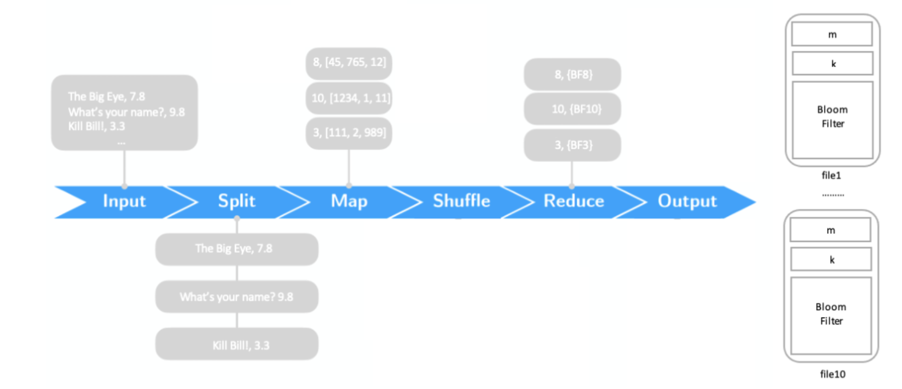

# BloomFilters-MapReduce
That project consists in create a bloom filter over the ratings of movies listed in the IMDb datasets.

It is realized following the MapReduce paradigm, with two different frameworks: Hadoop and Spark.

[Here1](requirements.pdf) are present the requirements of the project and the complete documentation is available [here2](documentation.pdf).

## Main goals are:
- To design a MapReduce algorithm to implement the bloom filters construction
- To implement the MapReduce bloom filters construction algorithm using the Hadoop and Spark framework

## Project structure
 - `BloomFilterHadoop`: the Java(8) Hadoop application module
 - `BloomFiltersSpark`: the python(3) Spark application module

(The execution of both the modules is completely configurable with the input parameters)

Commands examples:
```
hadoop jar BloomFilterB4.jar it.unipi.dii.inginf.cc.app.Application title_ratings.tsv outputparamsTest1 outputBFTest1 0.07 500000
hadoop jar BloomFilterB4.jar it.unipi.dii.inginf.cc.app.Test title_ratings.tsv outputparamsTest1 outputBFTest1 0.07 500000
spark-submit --master yarn main.py title.ratings.tsv 1 0.1> res.txt
```
## Preview
<p align="center">
   
</p>
